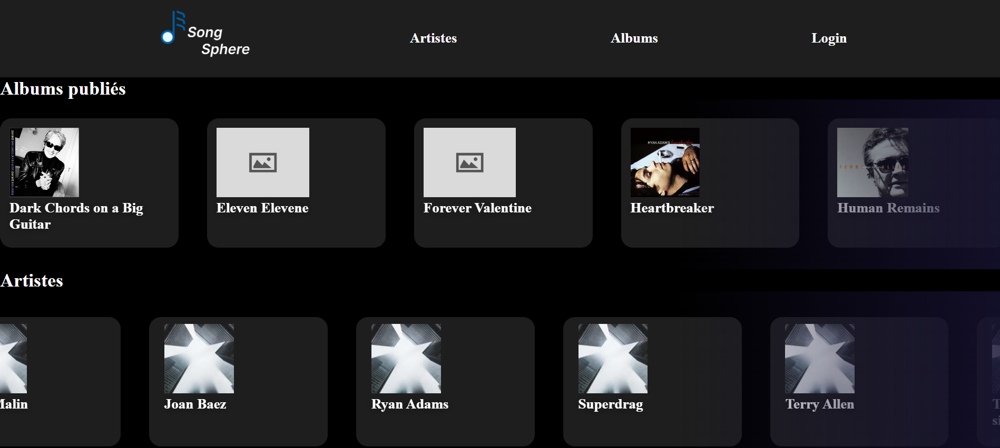

# SAE Web PHP

## Groupe

- Daniel Moreira
- Amélie Brizard
- Cassandra Maupou

## Création de la base de données
Pour créer la base de données de notre application web, vous devez entrer les lignes de commandes suivantes :

Si vous êtes sur Windows :
```shell
php .\Data\creationbd.php create-database

php .\Data\creationbd.php create-table

php .\Data\creationbd.php load-data
```

Si vous êtes sur Linux :
```bash
php ./Data/creationbd.php create-database

php ./Data/creationbd.php create-table

php ./Data/creationbd.php load-data
```

## Lancement de l'application

Avant de lancer l'application, assurez-vous que PHP est installé sur votre ordinateur.

S'il est installé, entrez dans votre terminal la commande suivante : 
```php
php -S localhost:8000
```
Cette commande permet de démarrer le serveur php et donc vous permet d'accéder à l'application web.

## Utilisation de l'application

Lorsque vous vous rendrez sur le lien menant à l'application web, vous atterirez sur la page d'accueil.



A partir de cette page, vous pouvez :
- Consulter les détails d'un album
- Consulter les détails d'un artiste
- Aller sur la page de recherche des artistes
- Aller sur la page de recherche des albums
- Vous connecter ou vous inscrire

## Fonctionnalités implémentées

Voici la liste des fonctionnalités que nous avons implémentées :
- Inscription et connexion d'un utilisateur
- Plusieurs méthodes de recherche (par nom, année, genre, etc)
- Le CRUD pour les albums
- La lecture des détails concernant les artistes